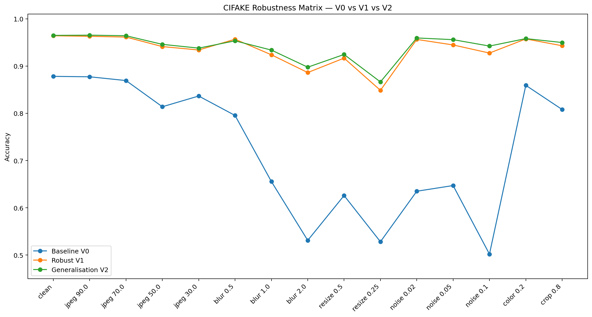
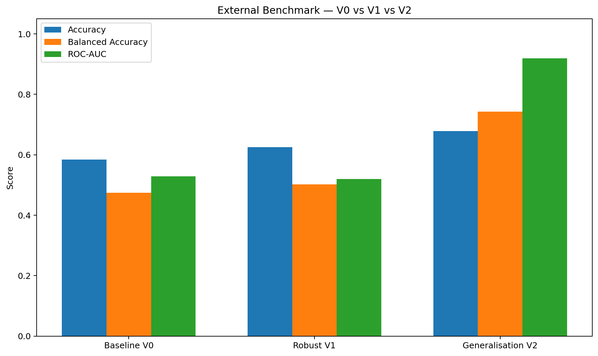
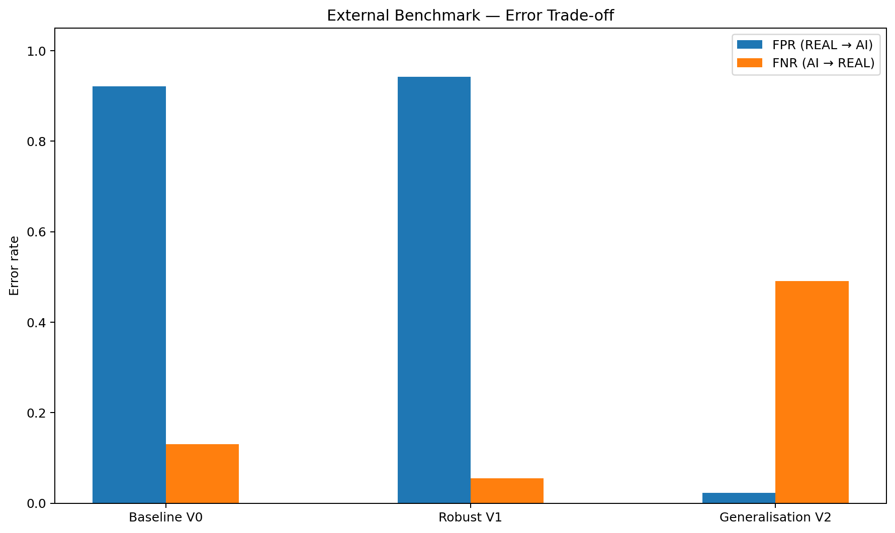
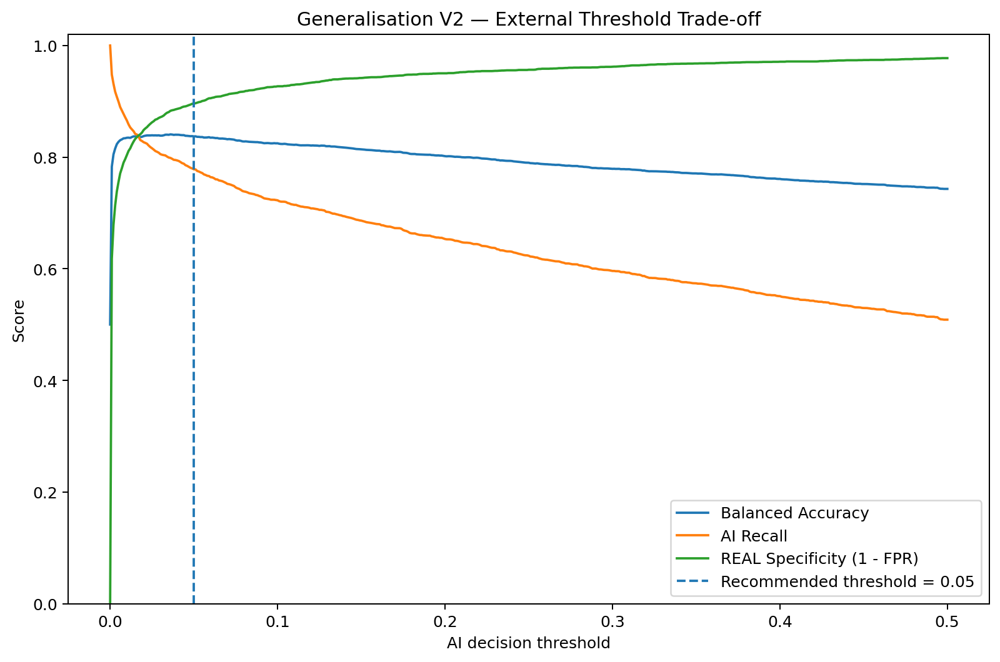
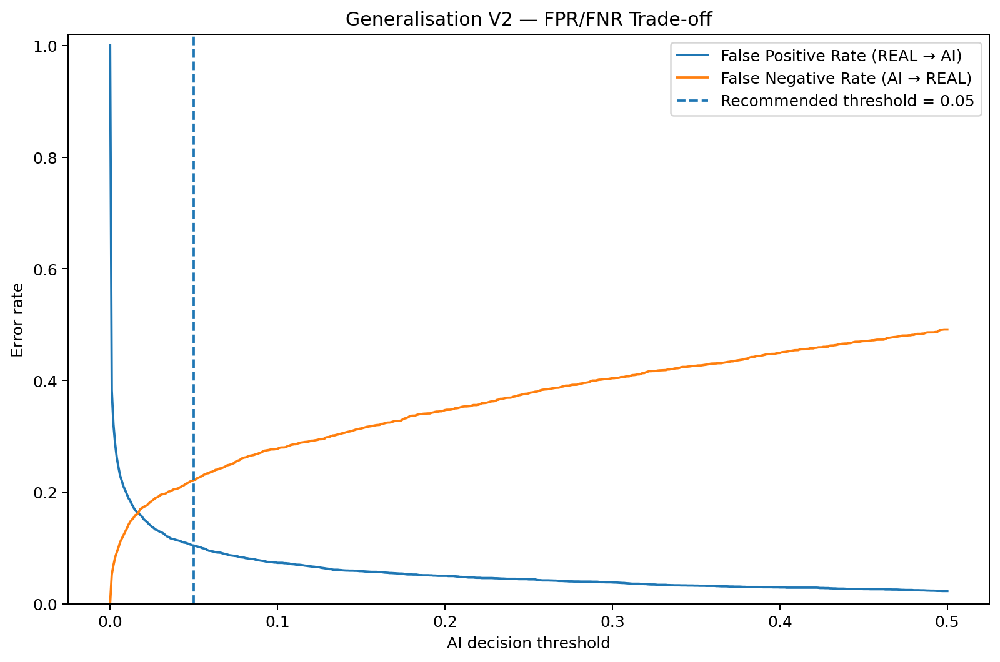

# TikTok TechJam 2026 — Track 5
## Robust Detection of AI-Generated Images

This repository contains our final submission for TikTok TechJam 2026 Track 5.

Our central finding is:

> **Transformation robustness and domain robustness are different problems.**

A detector can remain accurate after blur, compression, resizing, noise, color adjustment, and cropping, yet still fail badly when the image source changes. Our final model, **Generalisation V2**, was selected to improve both types of robustness.

---

## Final Model

**Checkpoint**

```text
generalisation_model_v2.pth
```

**Architecture**

- ResNet18
- Binary classifier
- Class `0` = FAKE / AIGC
- Class `1` = REAL

**Final checkpoint SHA-256**

```text
a02fcdca54bfa3ed142381d638c1114d9741a1c71a2376860d24965cdeebeaac
```

The raw AI score used by the submission is:

```python
P(AI) = softmax(logits)[0]
```

---

## Quick Start

### 1. Install dependencies

```bash
pip install -r requirements.txt
```

### 2. Run inference on one image

```bash
python inference/predict.py path/to/image.jpg
```

Example output:

```json
{"image":"path/to/image.jpg","ai_probability":0.8734}
```

The required model output is the raw `ai_probability`.

### 3. Optional demo binary decision

For the demo only, a calibrated threshold can be supplied:

```bash
python inference/predict.py path/to/image.jpg --threshold 0.05
```

Example:

```json
{
  "image": "path/to/image.jpg",
  "ai_probability": 0.8734,
  "threshold": 0.05,
  "demo_label": "AIGC"
}
```

The threshold does **not** change the raw probability.

`0.05` was selected on the provided demonstration validation subset as a simple operating point. It is **not claimed to be universally optimal**.

---

## Model Progression

We evaluated three ResNet18-based checkpoints:

1. **Baseline V0**
   - Stronger on clean in-domain images
   - Fragile under realistic image transformations

2. **Robust V1**
   - Strong transformation robustness
   - Severe external-domain REAL false-positive problem

3. **Generalisation V2**
   - Preserves robustness
   - Strongly improves external REAL generalisation
   - Selected as the final frozen checkpoint

---

## CIFAKE Robustness

| Model | Clean Accuracy | Worst-Case Accuracy | Mean Robust Accuracy |
|---|---:|---:|---:|
| Baseline V0 | 87.82% | 50.21% | 71.32% |
| Robust V1 | 96.41% | 84.86% | 93.29% |
| **Generalisation V2** | **96.48%** | **86.64%** | **93.96%** |

A representative severe-noise condition (`noise = 0.10`):

| Model | Accuracy |
|---|---:|
| Baseline V0 | 50.21% |
| Robust V1 | 92.75% |
| **Generalisation V2** | **94.23%** |

### Robustness Matrix



---

## External Demonstration Benchmark

We also evaluated on a separate demonstration benchmark:

- **4,998 COCO val2017 REAL images**
- **8,843 DALL-E Advanced AIGC images**
- **13,841 total images**

At the default threshold `0.50`:

| Model | Accuracy | Balanced Accuracy | ROC-AUC | AI Recall | FPR | FNR |
|---|---:|---:|---:|---:|---:|---:|
| Baseline V0 | 58.43% | 47.44% | 0.5281 | 87.00% | 92.12% | 13.00% |
| Robust V1 | 62.47% | 50.15% | 0.5199 | 94.52% | 94.22% | 5.48% |
| **Generalisation V2** | **67.80%** | **74.31%** | **0.9188** | 50.88% | **2.26%** | 49.12% |

The most important change is the external REAL false-positive rate:

```text
Robust V1:        94.22%
Generalisation V2: 2.26%
```

V2 also achieves an external ROC-AUC of **0.9188**, indicating strong ranking/discrimination even though the default `0.50` threshold is conservative for AIGC recall.

### External Model Comparison



### External Error Trade-off



---

## Threshold Calibration

For the demonstration binary decision, threshold `0.05` gives:

| Metric | V2 @ 0.05 |
|---|---:|
| Accuracy | 82.07% |
| Balanced Accuracy | 83.71% |
| AI Precision | 92.97% |
| AI Recall | 77.82% |
| AI F1 | 84.73% |
| REAL → AI FPR | 10.40% |
| AI → REAL FNR | 22.18% |

Relative to threshold `0.50`:

- **2,383 AIGC images are rescued**
- **407 additional REAL false positives are introduced**

This threshold is treated as **post-training calibration**, not a new trained model.

### Threshold Trade-off



### FPR / FNR Trade-off



---

## Error Definitions

We use:

```text
False Positive = REAL → predicted AI
False Negative = AI → predicted REAL
```

---

## Repository Structure

```text
.
├── generalisation_model_v2.pth
├── inference/
│   └── predict.py
├── results/
│   ├── evaluation_metadata.json
│   ├── robustness_summary.csv
│   ├── model_summary.csv
│   ├── cross_dataset_validation.csv
│   └── final_evidence/
├── evaluation/
├── demo/
├── docs/
├── techjam(1).ipynb
├── techjam(2).ipynb
├── requirements.txt
└── README.md
```

The notebooks are retained as development history. The public inference entry point is:

```text
inference/predict.py
```

---

## Reproducibility Contract

The final evaluation metadata is stored in:

```text
results/evaluation_metadata.json
```

Key contract:

```text
Final checkpoint: generalisation_model_v2.pth
FAKE / AIGC class index: 0
REAL class index: 1
P(AI): softmax(logits)[0]
Default threshold: 0.50
Demo calibrated threshold: 0.05
```

The final checkpoint hash was independently verified before integration.

---

## Limitations

The external validation set is a **demonstration benchmark** and does not determine the hidden final score.

Threshold calibration was performed on this demonstration subset, so `0.05` should not be interpreted as universally optimal.

Generalisation V2 still misses a subset of highly realistic AI-generated images. This reinforces the central lesson of our work: transformation robustness and cross-domain generator generalisation are related but distinct challenges.

---

## Final Status

- Final checkpoint: **Generalisation V2**
- Checkpoint verification: **PASS**
- Transformation robustness evaluation: **DONE**
- External benchmark: **DONE**
- Threshold analysis: **DONE**
- FP/FN error analysis: **DONE**
- Public inference script: **DONE**

**Final recommendation: freeze V2 and expose raw P(AI), with threshold calibration kept as optional decision logic.**
